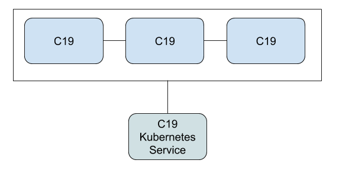

# Deploying as a Standalone Cluster

Since the C19 agent is agnostic to how and where it runs, you can deploy it as a standalone service.

You can then have it connect to other C19 agents by using the proper peer provider, depending on your usage, whether it's 
a Kubernetes cluster or anything else.

Once you have a C19 cluster you can create a service or other load balancer to act as a gateway to your C19 cluster and to 
allow you to get and set values to the shared state.

The C19 Protocol can be easily scaled horizontaliy by adding more replicas of C19 agents.
Once an agents comes online it will shortly after be updated with the current shared state.

Please refer to the [Standalone Distributed Cache Use Case] to get some more ideas.

[Standalone Distributed Cache Use Case]: use-case-standalone-cache.md
