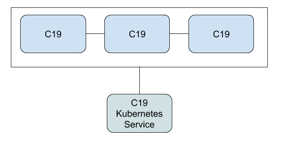

# Standalone Deployment Using Helm Chart

As you've seen in the use-cases chapter, the C19 can be deployed as a [standalone distributed cache].



[standalone distributed cache]: use-case-standalone-cache.md

In this section we will walkthrough a quick deployment of a standalone C19 cluster using a Helm chart.

# 1. The Helm Chart
```yaml
replicaCount: 3

image:
  repository: c19
  tag: "0.1.0"

service:
  type: ClusterIP
  port: 3097

agent:
  kind: Default
  port: 3097

connection:
  kind: Default
  port: 4097
  push_interval: 1000
  pull_interval: 60000
  r0: 3
  timeout: 1000

state:
  ttl: false
  purge_interval: 60000

config:
  filename: /etc/c19/config.yaml

log:
  level: c19=info

autoscaling:
  enabled: false
  minReplicas: 1
  maxReplicas: 100
  targetCPUUtilizationPercentage: 80

serviceAccount:
  create: false

ingress:
  enabled: false
```

If you've gone through the [Configuring the Agent] chapter, you should feel comfortable with the above Helm chart. It's just another form of describing the 
configuration which you already know.

You can find the helm chart under the `helm` repository of the C19 project.

Apply this to your Kubernetes cluster:
```shell
helm install getting-started helm/standalone
```

# 2. The C19 Service
Since we deployed C19 as a standalone distributed cache, we will find a C19 Kubernetes service that will traffic our data to and from 
the C19 pods:

```shell
$ kubectl get services
NAME                             TYPE        CLUSTER-IP    EXTERNAL-IP   PORT(S)    AGE
getting-started-c19-standalone   ClusterIP   10.96.29.46   <none>        3097/TCP   3m
```

The C19 service exposes the port 3097 and is accessible from across the cluster. 

# 3. Testing
To test the deployment, you can use the same techniques as we used in the previous chapter [Testing the Deployment].

[Testing the Deployment]: getting-started-test-deployment.md
[Configuring the Agent]: getting-started-configuration.md
